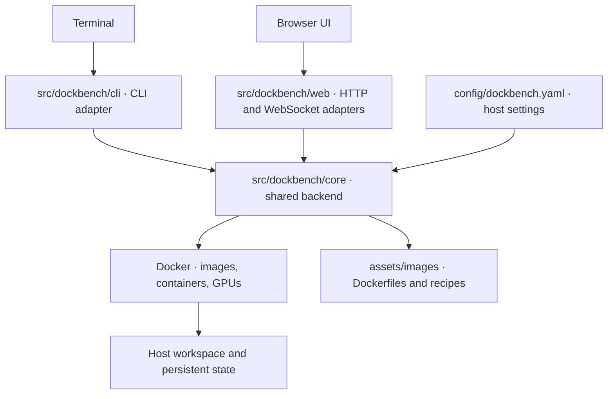

# Dockbench

Dockbench gives you a browser workbench and CLI for development containers on your
laptop or a remote GPU host. Build images, manage containers, open a shell, and use
a Linux desktop from the same interface.

## Quickstart

### 1. Prepare the Docker host

Use a Linux host with working Docker access. GPU workloads also need the NVIDIA
Container Toolkit; the bundled desktop image targets Ubuntu on `linux/amd64`.

```bash
git clone https://github.com/notAnyrobot/dockbench.git
cd dockbench
./scripts/bootstrap.sh
```

Bootstrap installs user-scoped `uv`, Node.js, and npm if needed. It checks Docker
access but does not install Docker. If tooling was just installed, open a new
terminal and return to the checkout before continuing.

### 2. Deploy and open the workbench

On the Docker host:

```bash
uv run dockbench server deploy
uv run dockbench web
```

Deployment installs dependencies, builds the browser UI, and starts the server.
For an HPC host, run deployment there, then open the workbench **from your laptop**
using its Dockbench checkout and `uv` installation:

```bash
uv run dockbench web YOUR_SSH_ALIAS
```

Keep that terminal open while using the SSH tunnel. The server listens on loopback;
`web` prints the URL and opens your browser.

### 3. Start a development container

On the Docker host, build the bundled desktop image once:

```bash
uv run dockbench image build
```

In the browser, select **New container**, choose the image and GPUs, and create it.
Use **Enter Bash** for a root shell or **Open desktop** for the Linux desktop.
The desktop toolbar's **Clipboard** panel transfers text between host and desktop.

The default workspace root is `~/workspace`, or `/data/$USER/workspace` on hosts
with that per-user directory. To customize it, copy the [host settings example](config/dockbench.example.yaml)
to `config/dockbench.yaml`, set `server.workspace` to an existing directory, then
stop/start the server to apply it. The directory appears inside containers as `/workspace`.

## Everyday commands

| Task | Command |
| --- | --- |
| Start the deployed server | `uv run dockbench server start` |
| Inspect the server | `uv run dockbench server status` |
| Stop the server | `uv run dockbench server stop` |
| Open the local workbench | `uv run dockbench web` |
| Open a remote workbench | `uv run dockbench web YOUR_SSH_ALIAS` |
| Enter a container shell | `uv run dockbench shell CONTAINER` |
| Inspect or stop the default container | `uv run dockbench status` / `uv run dockbench stop` |

Stopping the server leaves managed containers running.

## Architecture



CLI and web share the backend for image builds, container lifecycle, and access
preparation. Host settings stay separate from image recipes.

## Documentation

- [Usage reference](docs/usage.md): configuration, image recipes, container access,
  SSH, clipboard, and rootless Docker.
- [Architecture and contributor checks](docs/architecture.md): module ownership and tests.
- [Migrating to 1.0](docs/migration-1.0.md): retired aliases and existing installations.
